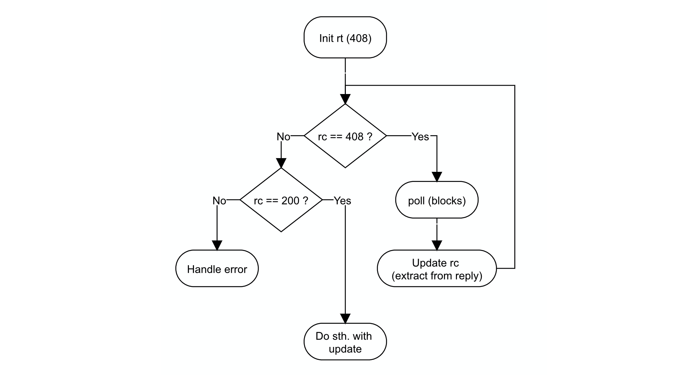

# Async Rest Library

The *Async Rest Library* implements [long-poll](https://en.wikipedia.org/wiki/Push_technology#Long_polling) functionality for convenient use in [Spring Rest Controllers](https://spring.io/projects/spring-boot).


## About

Some web-application require asynchronous updates, also known as server-side *push messages*.

 * Standard request-reply protocols do not support asynchronous updates, because all communication is client-initiated.
 * In many cases a RESTful (and therefore HTTP/request-reply) backend is still the preferred design option.

This library conveniently extends traditional REST endpoints by asynchronous replies.


## Basic Usage

The ARL is called from a Spring Controller's REST-endpoint method. The received request is then suspended until the next update or connection timeout.  

### Spring Controller Integration
```java
/**
 * A spring boot controller's REST endpoint method.
 * Sample access:
 * curl -X GET http://127.0.0.1/getupdate
 */
@GetMapping(value = "/getupdate")
public DeferredResult<ResponseEntity<String>> asyncGetState() {

    // Suspended reply until internal state change occurred or connection has timed out.
    // Recommended longpoll timeout is 30000 milliseconds.
    return ResponseGenerator.getAsyncUpdate(longPollTimeout, broadcastContentManager);
}
```

### Broadcast Content Manager

The ASR uses the generic [```BroadcastContentManager```](https://kartoffelquadrat.github.io/AsyncRestLib/eu/kartoffelquadrat/asyncrestlib/BroadcastContentManager.html) to keep track of state changes and unblock affected update requests.

 * Make your state class (the object your clients requested) implement the ASR's [```BroadcastContent```](https://kartoffelquadrat.github.io/AsyncRestLib/eu/kartoffelquadrat/asyncrestlib/BroadcastContent.html) interface.
 * The [```BroadcastContentManager```](https://kartoffelquadrat.github.io/AsyncRestLib/eu/kartoffelquadrat/asyncrestlib/BroadcastContentManager.html) (bcm) always holds exactly one instance of your custom [```BroadcastContent```](https://kartoffelquadrat.github.io/AsyncRestLib/eu/kartoffelquadrat/asyncrestlib/BroadcastContent.html) implementation.
 * To modify the server maintained state, provide a new [```BroadcastContent```](https://kartoffelquadrat.github.io/AsyncRestLib/eu/kartoffelquadrat/asyncrestlib/BroadcastContent.html) instance to your BCM, with:  
```bcm.updateBroadcastContent(theNewState)```
 * The BCM then automatically unblocks all affected withheld update requests.
 * To close you endpoint (e.g. server-shutdown), call ```bcm.terminate()```. This advises clients to stop polling.

### Return Codes

The ARL replies with one of the following three return codes. 

 * ```200 [OK]```: Update notification. **The HTTP body contains a JSON-string serialization of the update object**.
 * ```408 [Request Timeout]```: The HTTP request reached a timeout, without any state change on server side since.
 * ```500 [Internal server error]```: The request could not be answered, because the server does not offer asynchronous updates on this endpoint any longer.

### Client Long-Poll Counterpart

Clients can be written in any language that supports the HTTP.  
To receive the next update, clients poll until the server replies with a non-timeout (408):



Example java code:

```java
// Corresponding code for repeated poll until update or error.
int returnCode = 408
while(returnCode == 408)
{
    //poll
    HttpResponse<String> httpReply = Unirest.get(serverUpdateUrl).asString();
    returnCode = httpReply.getStatus();
}

// deserialize payload if an update was received
if (returnCode == 200)
{
    Foo myUpdatedFoo = new Gson().fromJson(httpReply.getBody(), Foo.class));
}
```
*Note: Commonly the above update strategy is itself returned in a loop, as long as further updates are offered and desired.*


## Advanced Usage

The ARL provides two more sophisticated methods to prevent redundant updates. They replace the ```getAsyncUpdate(...)``` method.

 * ```ResponseGenerator.getHashBasedUpdate(longPollTimeout, broadcastContentManager, hash)```  
Update requests contain a hash of the current client state. Requests with a non-matching hash are answered instantly.  
*If in doubt, call this method, rather than ```getAsyncUpdate(...)```.*

   * More reliable than ```getAsyncUpdate()```. The hash verification ensures that state changes arising during long-poll connection establishment are detected.
   * Can be used to retrieve an initial client state synchronously, instead of having to wait for the first update.

 * ```ResponseGenerator.getTransformedUpdate(longPollTimeout, broadcastContentManager, hash, transf, tag)```  
Allows custom [server-side transformations](https://kartoffelquadrat.github.io/AsyncRestLib/eu/kartoffelquadrat/asyncrestlib/Transformer.html) of state-changes, prior to propagation. 
   * Replies are withheld until a transformed update differs in hash and is non-empty.
   * Allows the injection of custom pub/sub filters on server side and reduce traffic.

### Hashing

Hash-based updates operate on a [MD5-sum of the JSON-string serialization](https://kartoffelquadrat.github.io/AsyncRestLib/eu/kartoffelquadrat/asyncrestlib/BroadcastContentHasher.html).  
ARL-internal hashing:  
```DigestUtils.md5Hex(new Gson().toJson(broadcastContent))```:

 * Google [Gson](https://mvnrepository.com/artifact/com.google.code.gson/gson/2.8.6): JSON-string serialization of Java beans.
 * Apache Commons [DigestUtils](https://mvnrepository.com/artifact/commons-codec/commons-codec/1.4): MD5 hasher library for Strings

## Project Integration

### Maven

Add the following repository block to your ```pom.xml```:

```xml
<repositories>
	<repository>
	    <id>jitpack.io</id>
	    <url>https://jitpack.io</url>
	</repository>
</repositories>
```

Then add the following dependency block:

```xml
<dependency>
    <groupId>com.github.kartoffelquadrat</groupId>
    <artifactId>AsyncRestLib</artifactId>
    <version>v1.3</version>
</dependency>
```

### Gradle

Add the following repository to your ```build.gradle```:

```
allprojects {
	repositories {
		...
		maven { url 'https://jitpack.io' }
	}
}
```

Then add the following dependency:

```
dependencies {
	implementation 'com.github.kartoffelquadrat:AsyncRestLib:v1.3'
}
```

## Quickstart

 1. Add the ARL as a project dependency to your Spring Boot project.
 2. Prepare a vanilla Spring-REST controller enpoint.
 3. Change the enpoint method's return type to: ```DeferredResult<ResponseEntity<String>>```
 4. Define your own extension to the ASR-provided [BroadcastContent](https://kartoffelquadrat.github.io/AsyncRestLib/eu/kartoffelquadrat/asyncrestlib/BroadcastContent.html) interface.  
-> Implement the ```isEmpty()``` method and **add a default constructor**.
 5. Initialize your Spring REST controller with a [BroadcastContentManager](https://kartoffelquadrat.github.io/AsyncRestLib/eu/kartoffelquadrat/asyncrestlib/BroadcastContentManager.html), use your [BroadcastContent](https://kartoffelquadrat.github.io/AsyncRestLib/eu/kartoffelquadrat/asyncrestlib/BroadcastContent.html) implementation as ```<Generic>```.
 6. *Optional*: Define your own transformer and likewise initialize it in your Spring REST controller:  
```private Transformer<ChatMessage> transformer = new IdentityTransformer<>();```
 7. From within your controller, call one of three ASR methods:
   * ```return ResponseGenerator.getAsyncUpdate(longPollTimeout, broadcastContentManager);```
   * ```return ResponseGenerator.getHashBasedUpdate(longPollTimeout, broadcastContentManager, hash);```
   * ```return ResponseGenerator.getTransformedUpdate(longPollTimeout, broadcastContentManager, hash, transformer,tag);```

## Contact / Pull Requests

 * Author: Maximilian Schiedermeier 
 * Github: Kartoffelquadrat
 * Webpage: https://www.cs.mcgill.ca/~mschie3

